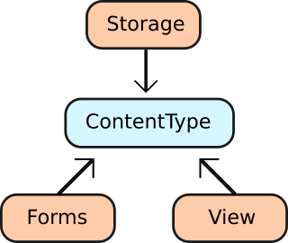

Content Type
============

What is it?
-----------

The ContentType component allows you to map content fields to an object.
Content fields can be simple scalar values, such as text, or compound objects
such as images or geolocations.

It provides:

- **Forms**: How the content type is modified.
- **Storage**: How the content type is stored.
- **View**: How the content type is rendered.

For example, a geolocation field will require at least 3 properties to be
mapped (long, lat, zoom), and we can imagine that it requires some javascript
to show the map in the frontend and also in the backend.

In brief this will allow you to define something like:

.. code-block:: php

    <?php

    use Psi\Component\ContentType\Metadata\Annotations as PsiCT;

    class Page
    {
        /**
         * @PsiCT\Field(type='text')
         */
        private $title;

        /**
         * @PsiCT\Field(type='markdown')
         */
        private $body;

        /**
         * @PsiCT\Field(type='image')
         */
        private $image;

        /**
         * @PsiCT\Field(type='geolocation')
         */
        private $location;

        /**
         * @PsiCT\Field(type='list', options={ "repository" = "repository_service" })
         */
        private $news;

        // ...

    }

After mapping an object you will be able to:

- Generate a Symfony form for it (form)
- Persist it (storage)
- Render it (view)

Getting Started
---------------

...

Roles
~~~~~

...

Form Rendering
~~~~~~~~~~~~~~

...

Frontend (website) Rendering
~~~~~~~~~~~~~~~~~~~~~~~~~~~~

...

Storage
-------

...

Persistence
~~~~~~~~~~~

.. note:: 

    Describe special actions required with PHPCR-ODM when persisting documents
    with collection mappings.
